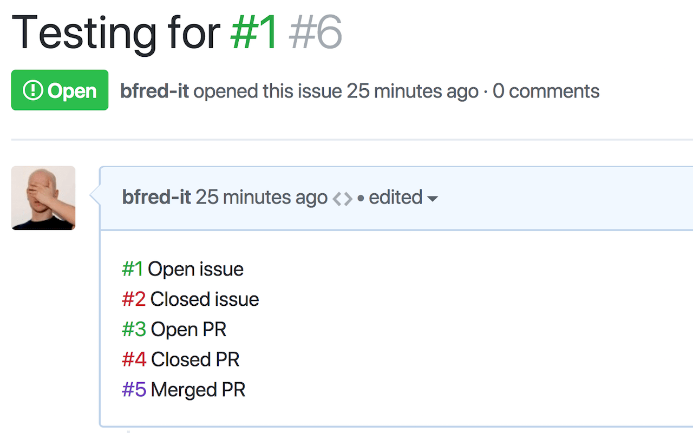

# GitHub Issue Link Status

[badge-cws]: https://img.shields.io/chrome-web-store/v/nbiddhncecgemgccalnoanpnenalmkic.svg?label=
[badge-amo]: https://img.shields.io/amo/v/github-issue-link-status.svg?label=
[link-cws]: https://chrome.google.com/webstore/detail/github-issue-link-status/nbiddhncecgemgccalnoanpnenalmkic 'Version published on Chrome Web Store'
[link-amo]: https://addons.mozilla.org/en-US/firefox/addon/github-issue-link-status/ 'Version published on Mozilla Add-ons'

ILS is a browser extension that colorizes issue and PR links to see their status (open, closed, merged). It uses GraphQL to make a single HTTP request to check all the links on a page at once. This means that **you'll need to create a API token and add it to the Options page or else the extension will not work.**

GitHub Enterprise is also supported. More info in the options.

## Installation 

- [**Chrome** extension](https://chrome.google.com/webstore/detail/github-issue-link-status/nbiddhncecgemgccalnoanpnenalmkic) [![][badge-cws]][link-cws]
- [**Firefox** add-on](https://addons.mozilla.org/en-US/firefox/addon/github-issue-link-status/) [![][badge-amo]][link-amo]

The chrome version also works in Opera (using [this](https://addons.opera.com/en/extensions/details/download-chrome-extension-9/)) and Edge.

## See Also

- [Refined GitHub](https://github.com/sindresorhus/refined-github/) - Browser extension that simplifies the GitHub interface and adds useful features
